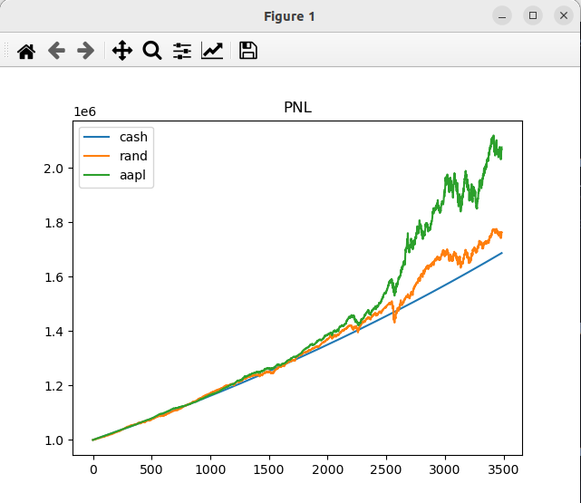

# Rotman_Scripts

## Preparing the data

Merge csvs by running `python merge_csvs.py arg1 arg2 arg3...` where the args are the paths to the csv files. This creates an output parquet file (compressed dataframe).

Clean the dataframe from above by running `python organize_data.py nov7/` where nov7/ is the path to the folder containing the parquet file. This program will sort the df by date and ticker and drop garbage rows. It will produce a clean.parquet file in that folder.

## Testing and comparing algos

In the algos/ directory, write your algo consisting of a single function `on_tick(date, data, state)` which takes in the current date, stock prices for this date, and a state dictionary that is passed between invocations. It should return a list of tuples (ticker, num_shares) - the trades it makes.

Backtest your algos: `python backtest.py nov7/ cash rand aapl`. This will run `algos/cash.py`, `algos/rand.py`, and `algos/aapl.py` on a decade's worth of historical data and generate graphs comparing pnl, sharpe, etc.

